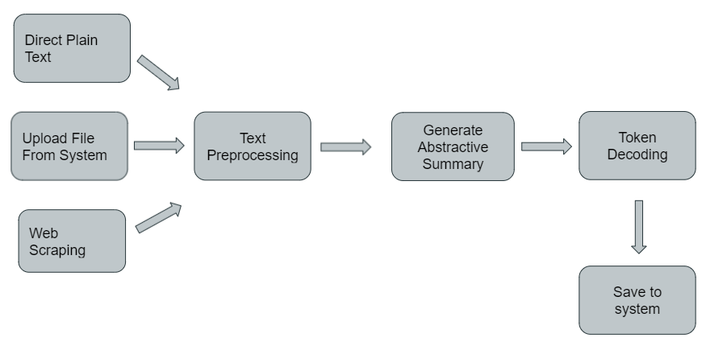

# Abstractive-Summarization-using-BART
An abstractive summarization tool that can condense documents and web pages using Bidirectional Auto-Regressive Encoders for Transformer or BART for short. It is a desktop application with a UI constructed with python.

## How to Run it
  1. Install required packages using thr requirements.txt 
  > pip install -r requirements.txt
  2. Run Main.py

## 1. Architecture Diagram

